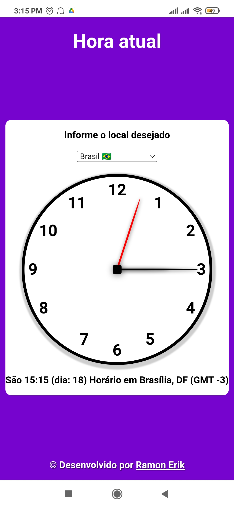
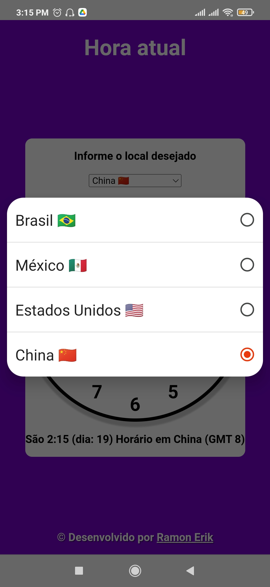
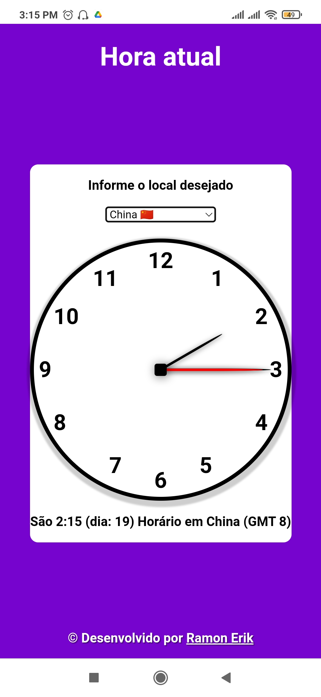

# Relógio Análogico

por meio deste link você pode acessar esse site

<https://ramon-erik.github.io/relogio/>

Neste projeto eu trago um relógio analógico funcional criado basicamente com **HTML e CSS**. E seu horário é atualizado usando um **script JS**.

Como **funcionalidade extra**, trouxe a possibilidade de ver que **horas são em outros locais**, como México, Estados Unidos, Inglaterra (posteriormente) e China. Fazendo um cálculo que adiciona ou subtrai a diferença de horas entre o GMT do usuario e o GMT do local em questão, tudo isso usando **JavaScript**.

    
    
    

